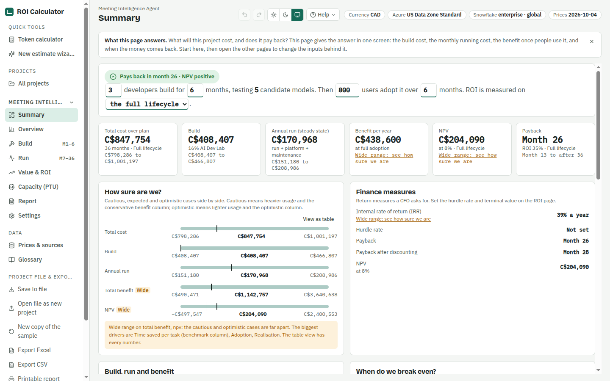
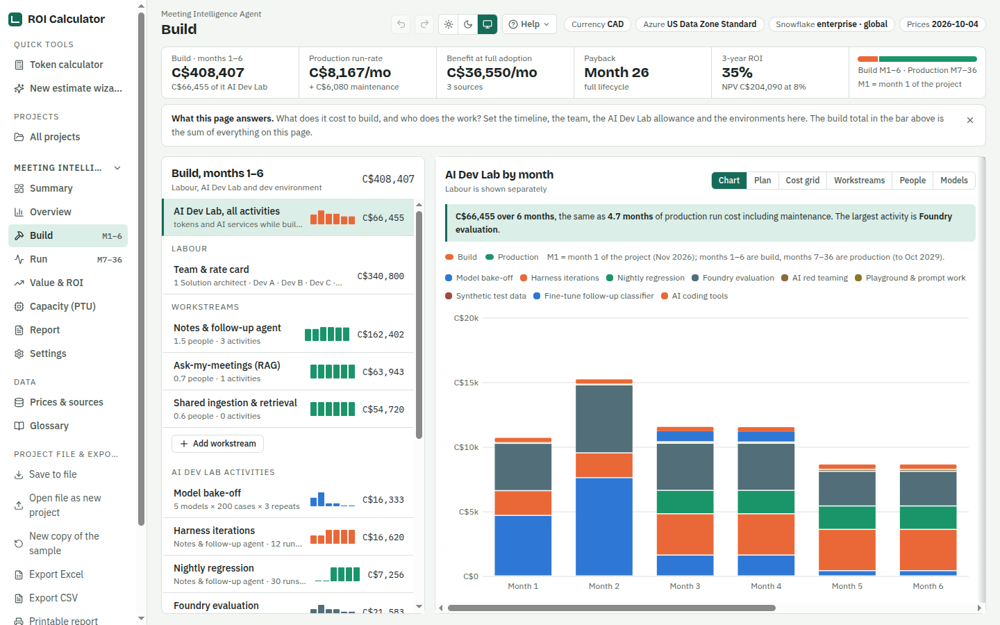
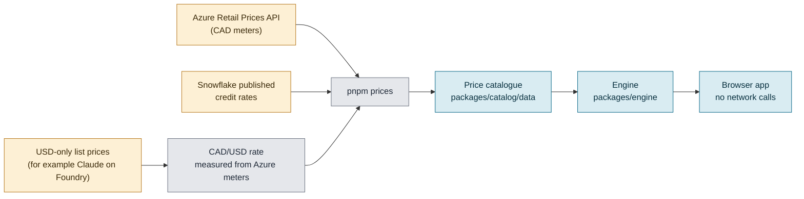

# ROI Calculator

A local, offline cost and ROI calculator for any technology project (new applications, enhancements, automation, migrations, replacing a system with SaaS, and AI), priced in CAD, with a token calculator for AI workloads.

[](https://github.com/nitin27may/roi-calculator/actions/workflows/ci.yml)
[](LICENSE)
[](https://github.com/nitin27may/roi-calculator/releases)

## What it does

- Estimates what a project costs to **build** and to **run**: team and delivery phases, environments, infrastructure, seats, contracts and fees, and, for AI projects, services and models.
- Measures the **return**: time saved, costs avoided, current-state savings and a scorecard of benefits that are not money, then payback month, ROI, NPV and IRR, with cautious, expected and optimistic cases.
- Runs entirely in your browser. No server, no account, no telemetry. Projects stay on your machine.

> **Estimates, not quotes.** Every figure comes from published list prices (Azure Retail Prices API, Snowflake's published credit rates) and from assumptions you set. Your contract, discounts, region and usage will differ. Use the numbers to compare options and make a case, then confirm them with the vendor.

## Screenshots

The Summary page on the bundled sample project (desktop, light):



The Build page: team, workstreams and the engineering tools & lab by month. The screenshots were taken before the wording sweep and still show the earlier "AI Dev Lab" label.



## Features

**Estimate the build**
- Labour from a rate card by delivery phase, with named people or role counts, shares of time per workstream, month windows and contingency.
- Workstreams (a feature with one or more agents) and templates: single agent, RAG feature, multi-agent feature, shared component.
- Delivery phases with hypercare after go-live, effort as hours or people x weeks, and one-time delivery costs such as vendor fees and training.
- Engineering tools & lab: tools and licences, test environments, load testing and AI-assisted development with a productivity percentage per role.
- AI experiments, for AI projects only: model bake-offs, harness iterations, nightly regression, Foundry evaluation, red teaming, synthetic data, fine-tuning and AI coding tools, with an editable cost grid and a month plan.
- Optional labour: exclude selected lines or set manual hourly rates.

**Environments and infrastructure**
- Environments (dev, test, UAT, production, disaster recovery) with a size factor, a schedule and optional billed months.
- A catalogue of 79 resource types and 526 SKUs, priced from the Azure Retail Prices API and vendor documents, with reserved terms, Azure Hybrid Benefit and dev/test pricing. Define a resource once and choose the environments it runs in.

**Estimate the run**
- Seats and licences, vendor or support contracts, and fees per transaction, next to hosting and platform costs.
- For AI projects, production workloads: transcription, documents, email, embeddings, AI Search, retrieval, chat, voice and agent harnesses at P50, P90 or worst case.
- Azure deployment per workload (Global, Canada Regional, US Data Zone) and a Standard or Batch processing tier.
- Snowflake Cortex workloads, shown in credits and in CAD.
- Capacity (PTU): pay-as-you-go against hourly, 1-month and 1-year provisioned throughput, with utilisation and break-even.

**Benefits and ROI**
- Current state: what the work costs today (people, licences, infrastructure, cost per transaction), with each line kept, reduced or retired from a chosen month, and the dual-running cost until then.
- Scorecard: non-financial items with a before and after, a weight and a confidence; only items you give a money value enter NPV and payback.
- Time-saving capabilities (per task, per user-week or per queue item), avoided costs and headcount, one-off benefits, adoption and realisation, with a benchmark library that records sources and confidence.
- Payback, ROI, NPV, IRR, hurdle rate and terminal value, on running cost only, running plus maintenance, or the full lifecycle.
- Sensitivity (tornado), before and after view, savings levers (reserved coverage, SKU size, non-production hours, volume, build length, go-live and decommission dates, labour rates, adoption, and model levers for AI), and scenarios you can compare and adopt.

**Token calculator**
- Quick estimates with no project: text (exact o200k count in the browser), documents with every route compared, audio, and a single agent run. Covers Azure OpenAI, Claude on Foundry and Snowflake Cortex.

**Guided start**
- A wizard that starts from the kind of change (nothing preselected) with recipes and templates, such as cheques to online payments. A first-run product tour, inline help on every input and a glossary grouped by topic.
- The Projects page groups the portfolio by project type and compares projects side by side.

**Exports**
- Excel workbook (summary, months, line items with formulas, ROI by capability, assumptions, prices used), CSV, JSON project file and a printable report you can save as PDF.

**Privacy**
- Everything stays in the browser. The app makes no network calls while you use it. Projects are saved in local storage; use Save to file and Open file to move them between machines.

## Quick start

Prerequisites: Node.js 22 and pnpm 10 (`corepack enable` picks up the pinned version).

```bash
git clone https://github.com/nitin27may/roi-calculator.git
cd roi-calculator
pnpm install
pnpm dev            # http://localhost:3000
```

```bash
pnpm build          # production build (static export)
pnpm test           # engine and catalogue tests
pnpm typecheck
pnpm validate       # catalogue integrity
```

On first load you get a sample project (a meeting intelligence agent) to click through.

## How prices work

The catalogue in `packages/catalog/data` holds every price with its source, retrieval date and a confidence level. Prices are refreshed on a networked machine and committed, so the app itself never goes online.



- Azure prices come from the Retail Prices API in CAD wherever a meter exists. Prices Microsoft publishes only in USD are converted at the CAD/USD rate measured from Azure's own meters. The rate and its date are shown in the app.
- Snowflake Cortex uses published credit rates and your CAD price per credit.
- Refresh with `pnpm prices:azure`, `pnpm prices:snowflake`, or `pnpm prices` for both. Add `--check` to report drift without writing. Details are in [docs/HANDOVER.md](docs/HANDOVER.md).
- These are list prices. They exclude enterprise discounts, reservations you have not modelled, tax and support.

## Project layout

| Path | What it holds |
| --- | --- |
| `apps/web` | Next.js 15 app, static export, Tailwind, Zustand store |
| `packages/engine` | Pure TypeScript calculation: workloads, Dev Lab, monthly ledger, ROI, levers, project schema and migrations |
| `packages/catalog` | Price and benchmark data (JSON), Zod schemas, token heuristics |
| `scripts/prices` | Price refresh scripts for Azure and Snowflake |
| `docs` | [Design](docs/DESIGN.md), [handover](docs/HANDOVER.md), [plan](docs/plan/README.md), [progress](docs/PROGRESS.md) |

## Roadmap

Today the product is strongest on AI cost: AI workloads, the AI Dev Lab and token estimation are the deepest parts. The next step is to cover any technology project (automation, replatforming, new applications, enhancements) with environments, a resource master, current against target cost and a benefit scorecard. This is planned, not built.

- Scope and gaps: [docs/plan/30-any-project-gaps.md](docs/plan/30-any-project-gaps.md)
- Status of every item: [docs/PROGRESS.md](docs/PROGRESS.md)

## Contributing

Contributions are welcome. Read [CONTRIBUTING.md](CONTRIBUTING.md) for setup, the checks to run and pull request rules. Price corrections and new Azure or Snowflake resources are covered there too.

- [Code of Conduct](CODE_OF_CONDUCT.md)
- [Security policy](SECURITY.md): report vulnerabilities privately, not in public issues
- [Support](SUPPORT.md): questions, bugs and price corrections

## Licence

[MIT](LICENSE)
